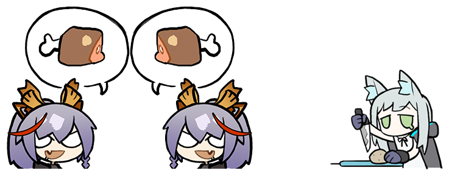
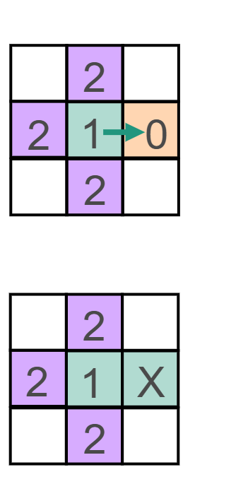

# Self-Organized Babel

$\\$

Riz Fernando Noronha

---

## Origin of Language

$\\$

> *Language has evolved as a   **means of communication***

$\\$

Is that  really true?

---

---

### Diversity in Languages

$\\$

Why isn't there a common language?

$\\$

$\\$

$\\$

$\\$

---

### Complexity of Language

$\\$

eg: Gender of inanimate objects

Is the benefit worth the cost?

---

### Hypothesis:

Language has evolved as a form of **discommunication**

Keep ideas secret from other tribes!

---

## The Model

$\\$

Language can represented as a **bit string** of length $B$
Each bit represents a *feature* or *word* in the language

$\\$

$$\vec{c} = \underbrace{\left[0,1,0,0,0,1,0 \right]}_B$$

---

### Understandability $\mathcal{U}$

$\\$

$$\vec{c}_1 = \left[0,1,0,0,0,1,0 \right]$$

$$\vec{c}_2 = \left[1,1,0,1,0,0,0 \right]$$

- Both languages have a word $\implies$ Understandable
- Only one has a word $\implies$ Not understandable
- Neither have a word $\implies$ Not understandable

$\mathcal{U}(\vec{c}_1, \vec{c}_2) = \sum\mathrm{AND}(\vec{c}_1, \vec{c}_2) = 1$

---

### Discommunication $d_H$

$\\$

$$\vec{c}_1 = \left[0,1,0,0,0,1,0 \right]$$

$$\vec{c}_2 = \left[1,1,0,1,0,0,0 \right]$$

Agents want to be *different* from others.

$d_H(\vec{c}_1, \vec{c}_2) = \sum\mathrm{XOR}(\vec{c}_1, \vec{c}_2) = 3$

---

### Evolutionary Algorithm

$\\$

- Start with agents on a lattice of $L\times L$, each speaking their own language

- Agents compete and gain fitness

- Fittest agents reproduce

---

Agents have both **local** and **global** interactions.

Local: $\mathcal{F_A} = (\alpha/4) \,\mathcal{U}(\vec{c}_A,\vec{c}_B)$

Global: $\mathcal{F_A} =  (\gamma/N) \,d_\mathcal{H}(\vec{c}_A,\vec{c}_B)$

$\\$

Each agent plays 4 local games and $L^2$ global games

---

### Fitness Function

$\\$

$$ 
\mathcal{F_A} = \underbrace{\frac\alpha4 \,\sum_{x\in\mathrm{nbrs}}\mathcal{U}(\vec{c}_A,\vec{c}_x)}_\textrm{understandability} + \underbrace{\frac\gamma{L^2} \, \sum_{y=0}^{L^2}d_\mathcal{H}(\vec{c}_A,\vec{c}_y)}_\textrm{discommunication}
$$

---

### Parameters

$\\$

$\alpha$ : Communicative bonus

$\\$

$\gamma$ : Discommunication bonus = 1

$\mu$ : Mutation rate = 0.001

$L$ : System size = 256

$B$ : Length of the bit string = 16

---

### Reproduction

Choose a random site to reproduce

Find the weakest neighbour

Winner "kills and invades" the loser: replace the loser with (mutated) clone of the winner

Newly added agents are frozen until the next timestep

Mutate the entire lattice

---

<iframe width="100%" height="100%" src="https://rizfn.github.io/babel-transition/visualizations/understandabilityVsHamming2D/" style="border: 1px solid #ccc" frameborder=0>
</iframe>

---

### Transition to Diversity

 $\phantom{mm}$  

---

### Different fitness, but coexistence!

$\\$

Boundary fitness is equalized!

$\\$

---

### Population timeseries

Low $\mu$ $\implies$ punctuated equilibria:
Switching between metastable states.

---

New clusters form at **boundaries!**

$\\$

---

A **phylogenetic tree** can be drawn.

$\\$

But is it truly correct?

---

### Emergent Borrowing

1101 and 1110 are equally like to mutate.
Mutants that borrow are selected.

---

---

#### Mutation rate scaling

 $\phantom{m}$ 

 $\phantom{mmmm}$ 

---

### 1D Mutation rate scaling

$\\$

---

### Why the same size?

Assume boundary fitness equalization & ideal case of 3 languages, $c_1$, $c_2$, $c_3$ with populations $N_1$, $N_2$, $N_3$.

$$\left(\frac\alpha\gamma - N_3 \right)\left[f_1 - f_2\right] = d_\mathcal{H}(c_2, c_1) \left[N_1 - N_2\right]
$$

---

## Conclusion

$\\$

Robust diversity can arise from antagonism

*Emergent behaviour*: punctuated equilibira, borrowing, coexistence of less-fit languages, new cluster formation at boundaries

Much stems from a **high dimensional state** and a **context-dependent fitness.**