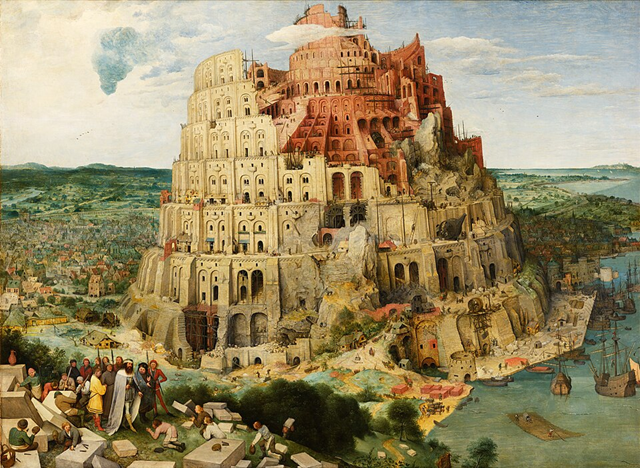

# Self-Organized Babel

$\\$

Riz Fernando Noronha

---

## Origin of Language

$\\$

> *Language has evolved as a   **means of communication***

$\\$

Is that  really true?

---

---

### Diversity in Languages

$\\$

Why isn't there a common language?

$\\$

$\\$

$\\$

$\\$

---

### Complexity of Language

$\\$

eg: Gender of inanimate objects

Is the benefit worth the cost?

---

### Hypothesis:

Language has evolved as a form of **discommunication**

Keep ideas secret from other tribes!

---

## The Model

$\\$

Language can represented as a **bit string** of length $B$
Each bit represents a *feature* or *word* in the language

$\\$

$$\vec{c} = \underbrace{\left[0,1,0,0,0,1,0 \right]}_B$$

---

### Understandability $\mathcal{U}$

$\\$

$$\vec{c}_1 = \left[0,1,0,0,0,1,0 \right]$$

$$\vec{c}_2 = \left[1,1,0,1,0,0,0 \right]$$

- Both languages have a word $\implies$ Understandable
- Only one has a word $\implies$ Not understandable
- Neither have a word $\implies$ Not understandable

$\mathcal{U}(\vec{c}_1, \vec{c}_2) = \sum\mathrm{AND}(\vec{c}_1, \vec{c}_2) = 1$

---

### Discommunication $d_H$

$\\$

$$\vec{c}_1 = \left[0,1,0,0,0,1,0 \right]$$

$$\vec{c}_2 = \left[1,1,0,1,0,0,0 \right]$$

Agents want to be *different* from others.

$d_H(\vec{c}_1, \vec{c}_2) = \sum\mathrm{XOR}(\vec{c}_1, \vec{c}_2) = 3$

---

### Evolutionary Algorithm

$\\$

- Start with agents, each speaks their own language

- Agents compete and gain fitness

- Fittest agents reproduce

---

### Fitness Function

$\\$

Agents $A$ and $B$ compete against each other.

$\\$

$$ \mathcal{F_A} =  \underbrace{\gamma \,\frac{d_\mathcal{H}(\vec{c}_1,\vec{c}_2)}{B}}_\textrm{discommunication} + \underbrace{\alpha \,\frac{\mathcal{U}(\vec{c}_1,\vec{c}_2)}{B}}_\textrm{understandability} $$

---

### Exact evolutionary details:

- Each generation, each agent competes with every other agent, and gains fitness

- Total fitness is calculated.

- Top 50% of agents reproduce.

- New agents' languages are inherited, but each bit can flip with probability $\mu$.

---

### Evolutionary Parameters

$\\$

$N$ : Number of agents = 1000
$N_{generations}$ : Number of generations = 1000
$N_{winners}$ : Number of winners (selection pressure) = 500

---

### "Real" Parameters

$\\$

$\alpha$ : Relatedness bonus

$\gamma$ : Discommunication bonus

$\\$

$B$ : Length of the bit string = 16

$\mu$ : Mutation rate = 0.01

---

---

Can be explained through a **reward matrix!**

$\\$

For a single bit language, $\vec{c}\in0,1$

---

## Lattice Model

$\\$

The same dynamics, but on a lattice!

Use a square lattice, of $L\times L$

One agent on each lattice site

Agents again play games, and gain fitness

---

Agents have both **local** and **global** interactions.

Local: $\mathcal{F_A} = (\alpha/4) \,\mathcal{U}(\vec{c}_A,\vec{c}_B)$

Global: $\mathcal{F_A} =  (\gamma/N) \,d_\mathcal{H}(\vec{c}_A,\vec{c}_B)$

$\\$

Each agent plays 4 local games and $L^2$ global games

---

### Reproduction

Choose a random site to reproduce

Find the weakest neighbour

Winner "kills and invades" the loser: replace the loser with (mutated) clone of the winner

Newly added agents are frozen until the next timestep

Mutate the entire lattice

---

<iframe width="100%" height="100%" src="https://rizfn.github.io/babel-transition/visualizations/understandabilityVsHamming2D/" style="border: 1px solid #ccc" frameborder=0>
</iframe>

---

---

---

---

---

---

---

---

---

