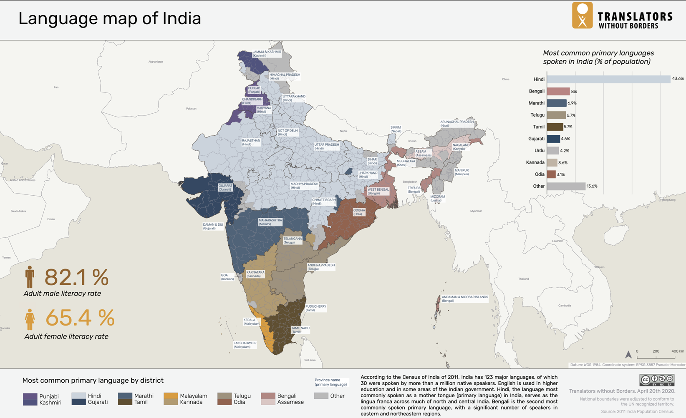
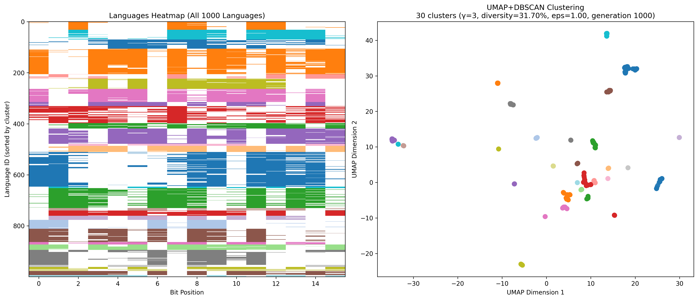
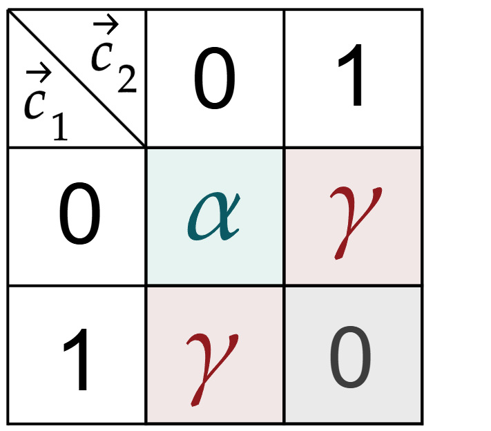
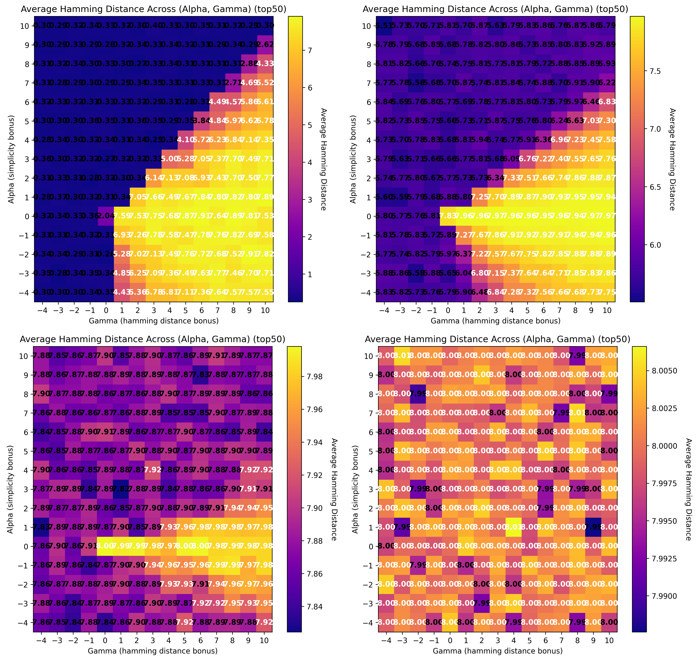
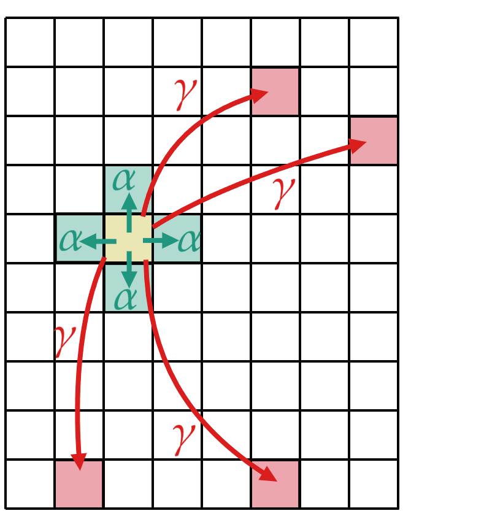
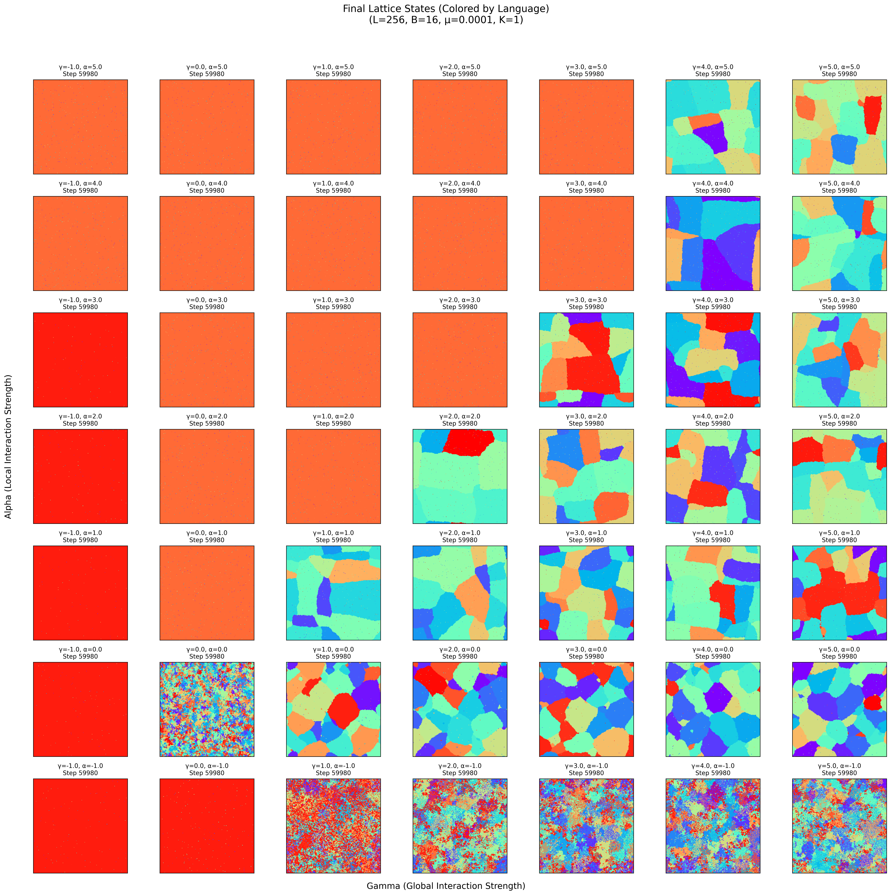
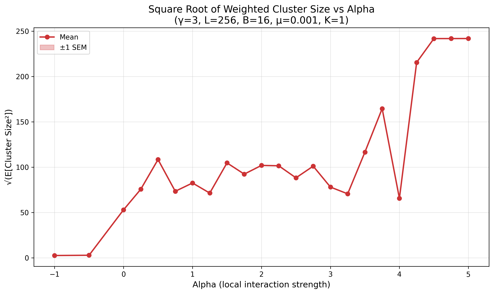

# Self-Organized Babel

$\\$

Riz Fernando Noronha

---

## Origin of Language

$\\$

> *Language has evolved as a   **means of communication***

$\\$

Is that  really true?

---

---

### Diversity in Languages

$\\$

English speakers can't learn Japanese!

$\\$

$\\$

$\\$

$\\$

---

### Complexity of Language

$\\$

eg: Gender of inanimate objects

Is the benefit worth the cost?

---

### Hypothesis:

Language has evolved as a form of **discommunication**

Keep ideas secret from other tribes!

---

---

## The Model

$\\$

Language can represented as a **bit string** of length $B$
Each bit represents a *feature* or *word* in the language

$\\$

$$\vec{c} = \underbrace{\left[0,1,0,0,0,1,0 \right]}_B$$

---

### Understandability $\mathcal{U}$

$\\$

$$\vec{c}_1 = \left[0,1,0,0,0,1,0 \right]$$

$$\vec{c}_2 = \left[1,1,0,1,0,0,0 \right]$$

- Both languages have a word $\implies$ Understandable
- Only one has a word $\implies$ Not understandable
- Neither have a word $\implies$ Not understandable

$\mathcal{U}(\vec{c}_1, \vec{c}_2) = \sum\mathrm{AND}(\vec{c}_1, \vec{c}_2) = 1$

---

### Evolutionary Algorithm

$\\$

- Start with agents, each speaks their own language
- Agents compete and gain fitness
- Fittest agents reproduce

---

### Fitness Function

$\\$

Agents $A$ and $B$ compete against each other.

$\\$

$$ \mathcal{F_A} =  \underbrace{\gamma \,\frac{d_\mathcal{H}(\vec{c}_1,\vec{c}_2)}{B}}_\textrm{discommunication} + \underbrace{\alpha \,\frac{\mathcal{U}(\vec{c}_1,\vec{c}_2)}{B}}_\textrm{understandability} $$

---

$\\$
$\\$
$\\$
$\\$
$\\$
$\\$
$\\$
$\\$
$\\$
$\\$

<audio controls preload src="../fig/jun10/v72_40056.mp3"></audio>

---

### Exact evolutionary details:

- Each generation, the $N$ agents play $N_{rounds}$ games.

- Each round, agents are ranomly paired up and play.

- Average fitness is calculated.

- Top $N_{winners}$ of agents reproduce.

- New agents' languages are inherited, but each bit can flip with probability $\mu$.

---

### Evolutionary Parameters

$\\$

$N$ : Number of agents = 1000
$N_{rounds}$ : Number of games per generation = 500
$N_{generations}$ : Number of generations = 1000
$N_{winners}$ : Number of winners (selection pressure) = 500

---

### "Real" Parameters

$\\$

$\alpha$ : Relatedness bonus
$\gamma$ : Discommunication bonus

$B$ : Length of the bit string = 16

$\mu$ : Mutation rate = 0.01

---

---

### Number of communicable people

---

---

Can be explained through a **reward matrix!**

$\\$

For a single bit language, $\vec{c}\in0,1$

---

### Error catastrophe

Increasing $\mu$ changes the system!

(0.01, 0.1,
0.3, 0.5)

---

## Lattice Model

$\\$

The same dynamics, but on a lattice!

Use a square lattice, of $L\times L$

One agent on each lattice site

Agents again play games, and gain fitness

---

Agents have both **local** and **global** interactions.

Local: $\mathcal{F_A} = \alpha \,\mathcal{U}(\vec{c}_A,\vec{c}_B)$

Global: $\mathcal{F_A} =  \gamma \,d_\mathcal{H}(\vec{c}_A,\vec{c}_B)$

$\\$

Each agent plays 4 local games and $L^2$-5 global games

---

### Reproduction

$\\$

Iterate over "winners" with high fitness

For each winner, find a "loser": the weakest among it's four neighbours

Winner "kills and invades" the loser: replace the loser and winner with (mutated) clones of the winner

Newly added agents are frozen until the next timestep

---

<video width="100%" preload controls src="../fig/jul3/L_256_g_1_a_1_B_16_mu_0.001_K_1.mp4"></video>

---

<video width="100%" preload controls src="../fig/jul3/start1_L_256_g_1_a_1_B_16_mu_0.001_K_1.mp4"></video>

---

---

---

Doesn't look particularly good...

---

---

---

---

---

---

### Future Work

$\\$

Find a better solution for clustering!

Quantify error catastrophe

Look for correlation lengths
