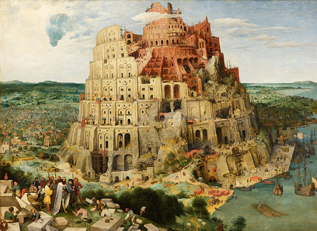

# Self-Organized Babel

$\\$

Riz Fernando Noronha

---

## Origin of Language

$\\$

> *Language has evolved as a   **means of communication***

$\\$

Is that  really true?

---

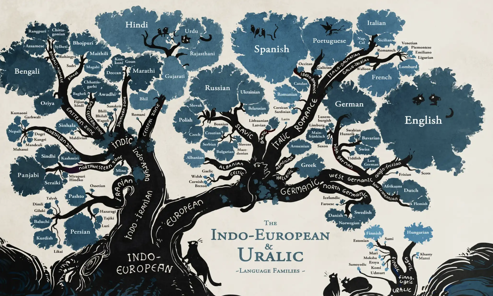

---

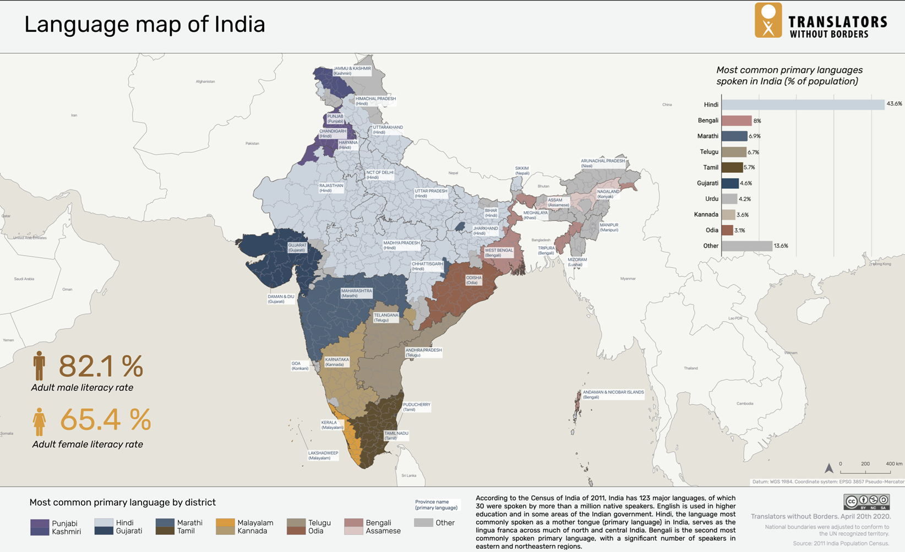

---

## Diversity & Complexity

$\\$

- English speakers can't learn Japanese!

- While we can communicate through body language, it's not as easy to do so through spoken language!

---

## The Model

$\\$

Language can represented as a **bit string** of length $B$
Each bit represents a *feature* or *word* in the language

$\\$

$$\vec{c} = \underbrace{\left[0,1,0,0,0,1,0 \right]}_B$$

---

### Understandability $\mathcal{U}$

$\\$

$$\vec{c}_1 = \left[0,1,0,0,0,1,0 \right]$$

$$\vec{c}_2 = \left[1,1,0,1,0,0,0 \right]$$

- Both languages have a word $\implies$ Understandable
- Only one has a word $\implies$ Not understandable
- Neither have a word $\implies$ Not understandable

$\mathcal{U}(\vec{c}_1, \vec{c}_2) = \mathrm{AND}(\vec{c}_1, \vec{c}_2) = 1$

---

### Evolutionary Algorithm

$\\$

- Start with agents, each speaks their own language
- Agents compete and gain fitness
- Fittest agents reproduce

---

### From last time

$\\$

$$ \mathcal{F_A} = \underbrace{\lVert \vec{c}_A \rVert_1}_\textrm{complexity} + \underbrace{\gamma \,d_\mathcal{H}(\vec{c}_A,\vec{c}_B)}_\textrm{discommunication} + \underbrace{\alpha \,d_\mathcal{G}(A, B)}_\textrm{family} $$

$d_\mathcal{G}$ doesn't work. 

Depends heavily on $\beta$, selection pressure.

---

### Fitness Function

$\\$

Agents $A$ and $B$ compete against each other.

$\\$

$$ \mathcal{F_A} =  \underbrace{\gamma \,d_\mathcal{H}(\vec{c}_A,\vec{c}_B)}_\textrm{discommunication} + \underbrace{\alpha \,\mathcal{U}(\vec{c}_A,\vec{c}_B))}_\textrm{understandability} $$

---

$\\$
$\\$
$\\$
$\\$
$\\$
$\\$
$\\$
$\\$
$\\$
$\\$

<audio controls preload src="../fig/jun10/v72_40056.mp3"></audio>

---

### Exact evolutionary details:

- Each generation, the $N$ agents play $N_{rounds}$ games.

- Each round, agents are ranomly paired up and play.

- Average fitness is calculated.

- Top $N_{winners}$ of agents reproduce.

- New agents' languages are inherited, but each bit can flip with probability $\mu$.

---

### Evolutionary Parameters

$\\$

$N$ : Number of agents
$N_{rounds}$ : Number of games per generation
$N_{generations}$ : Number of generations
$\mu$ : Mutation rate
$N_{winners}$ : Number of winners (selection pressure)

---

### "Real" Parameters

$\\$

$\alpha$ : Relatedness bonus
$\gamma$ : Discommunication bonus

$B$ : Length of the bit string

---

### Analyzing resultant languages

$\\$

Need a nice **clustering algorithm!**

DBSCAN has a problem, if A links with B, and B links with C, then A and C are linked!

Clique based clustering is NP!

---

## Results

$\\$

......still not a lot...

---

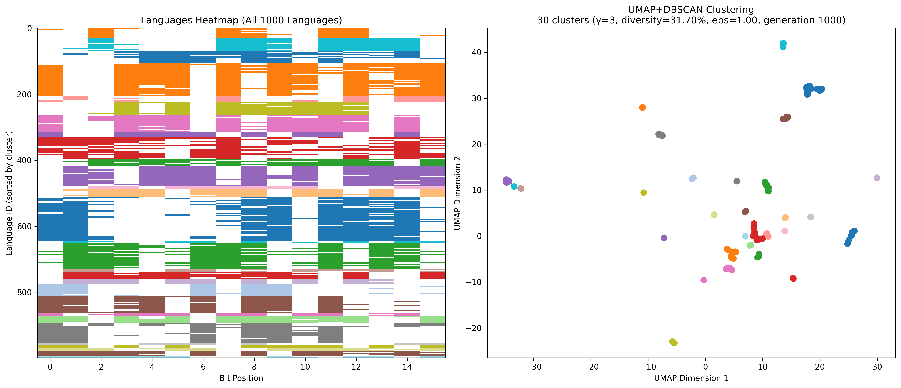

---

### Number of communicable people

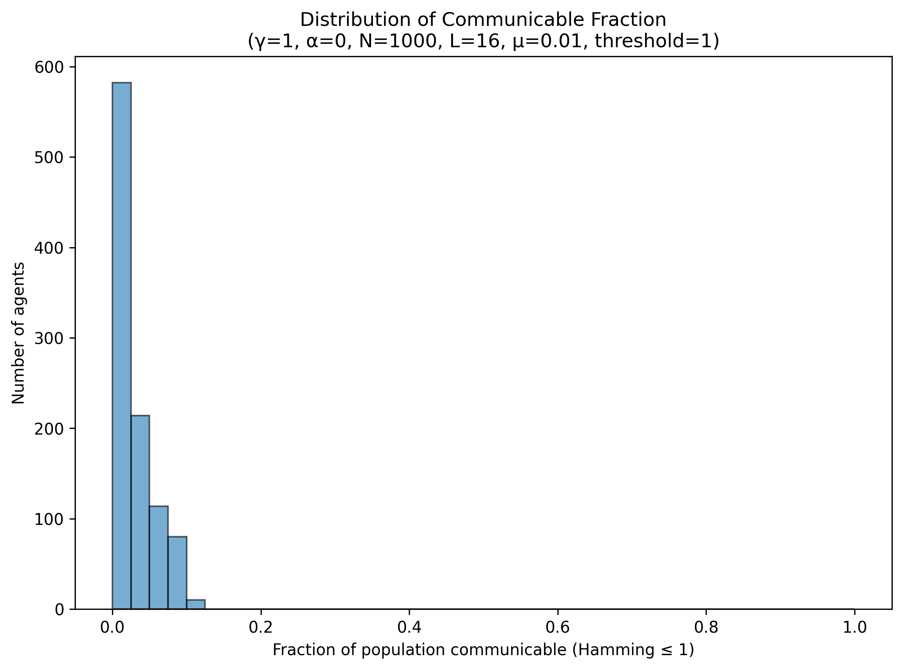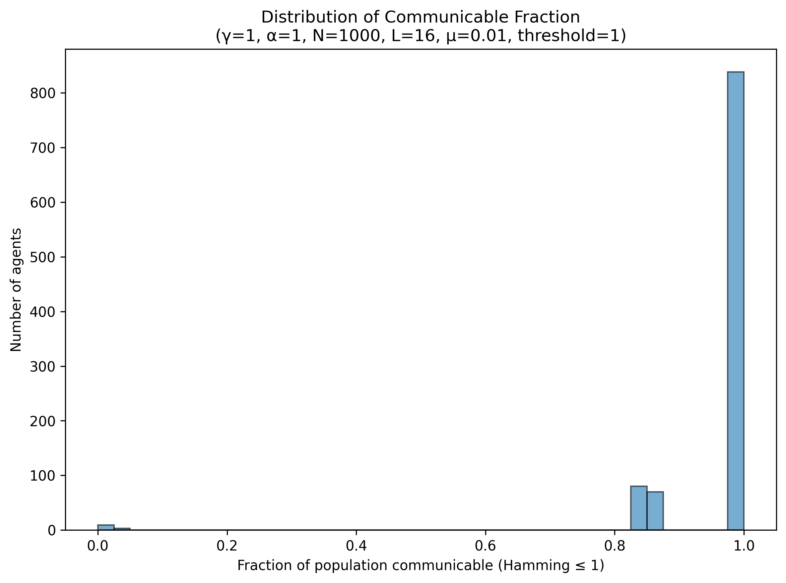

---

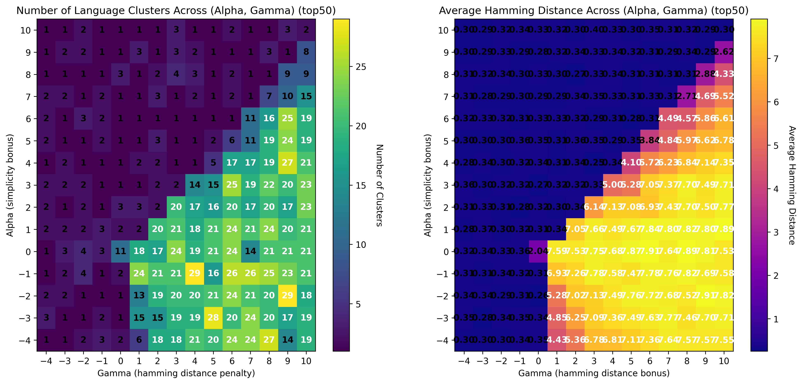

---

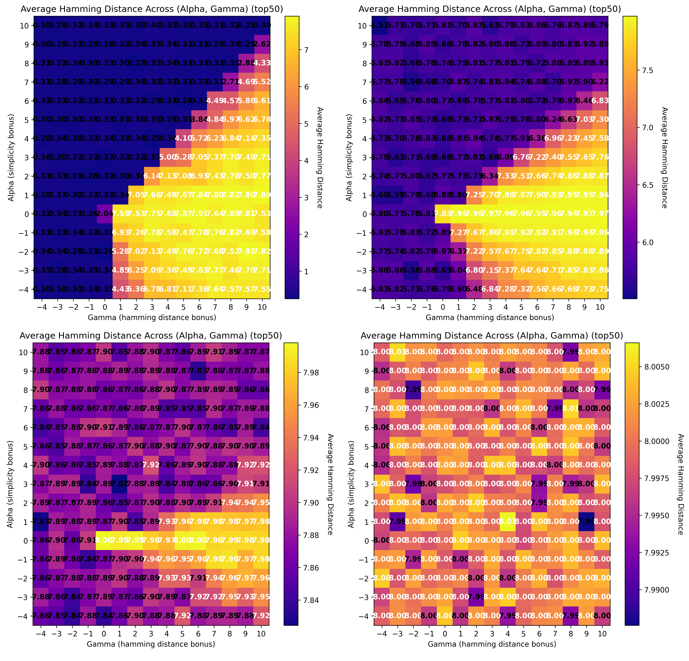

### Error catastrophe

Increasing $\mu$ changes the system!

(0.01, 0.1,
0.3, 0.5)

---

## Lattice Model

$\\$

The same dynamics, but on a lattice!

Use a square lattice, of $L\times L$

One agent on each lattice site

Agents again play games, and gain fitness

---

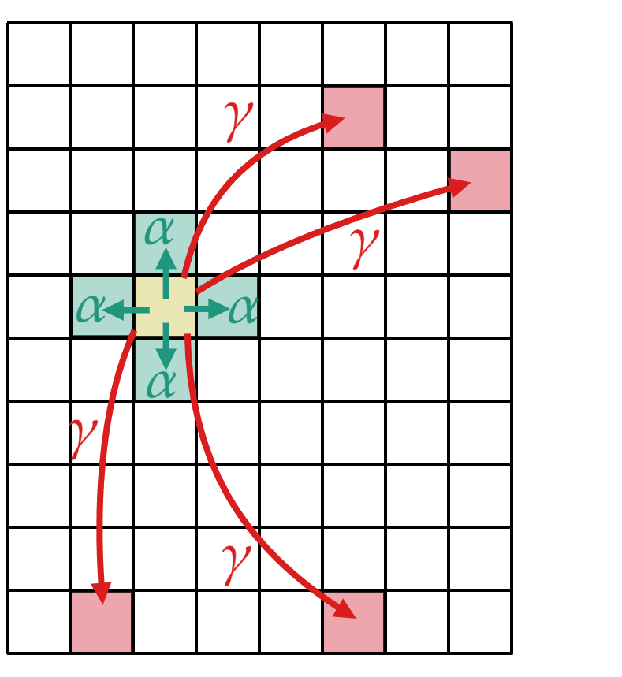

Agents have both **local** and **global** interactions.

Local: $\mathcal{F_A} = \alpha \,\mathcal{U}(\vec{c}_A,\vec{c}_B)$

Global: $\mathcal{F_A} =  \gamma \,d_\mathcal{H}(\vec{c}_A,\vec{c}_B)$

$\\$

Each agent plays 4 local games and 4$r$ global games, with random opponents

---

### Reproduction

$\\$

Iterate over "losers" with low fitness

For each loser, look for the fittest agent in radius $K$

Winner "kills and invades" the loser: replace the loser and winner with (mutated) clones of the winner

Newly added agents are frozen until the next timestep

---

### $\alpha$ dominant

$\\$
$\\$
$\\$
$\\$
$\\$
$\\$
$\\$
$\\$

$\alpha=1, \;\gamma=1, \;r=0.5$

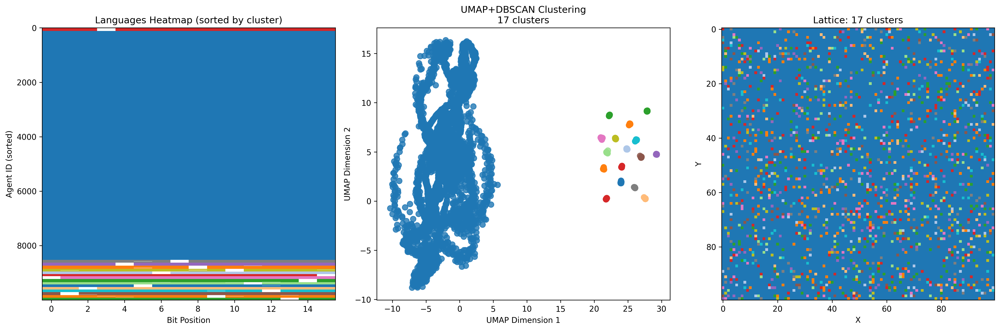

---

### $\gamma$ dominant

$\\$
$\\$
$\\$
$\\$
$\\$
$\\$
$\\$
$\\$

$\alpha=1, \;\gamma=1, \;r=2$

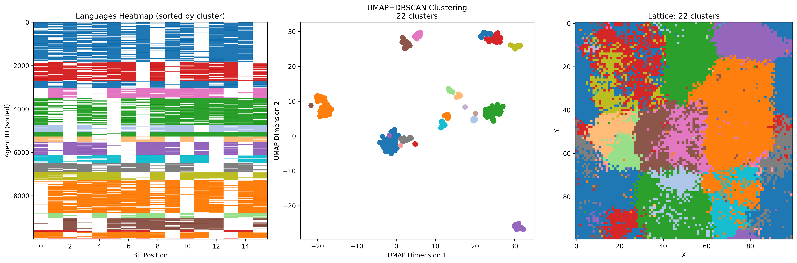

---

### Heatmaps for $r=1$

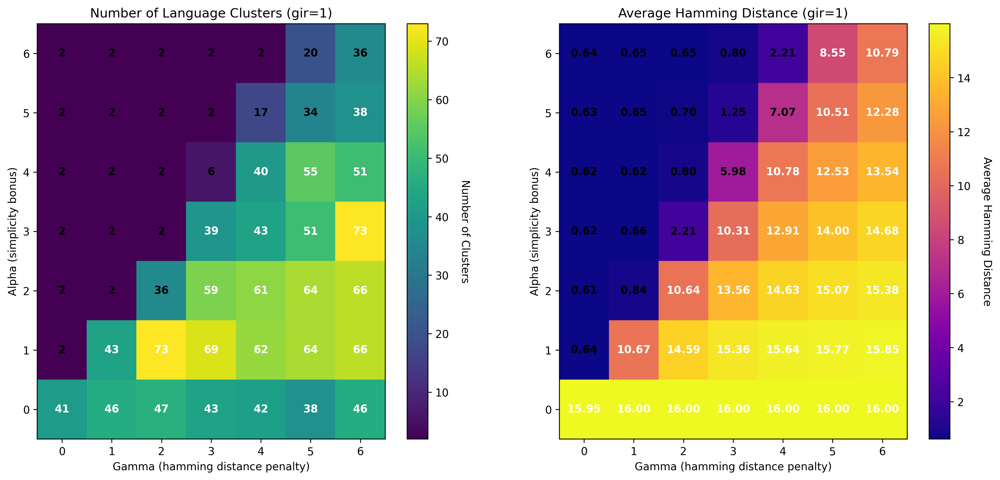

---

### Heatmaps for $r=2$

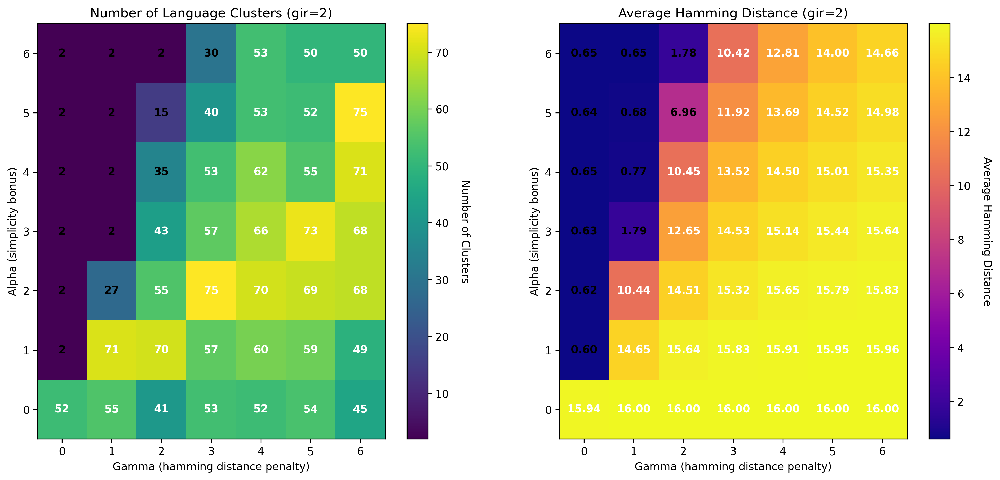

---

### Heatmaps for $r=0.5$

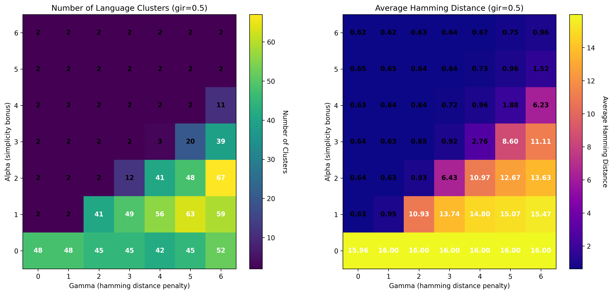

---

### Future Work

$\\$

Find a better solution for clustering!

Quantify error catastrophe

Look for correlation lengths
