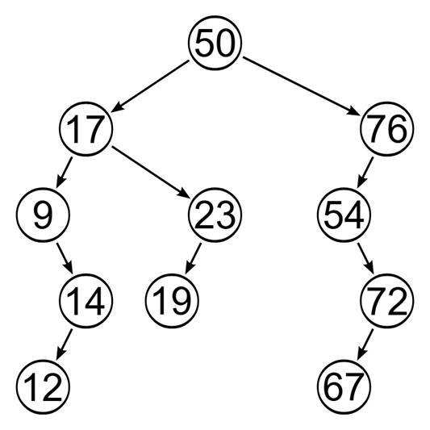
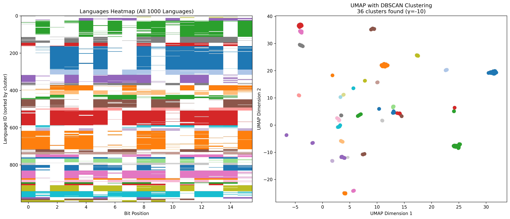
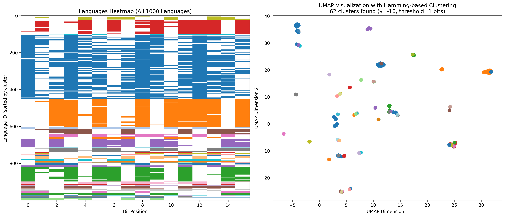
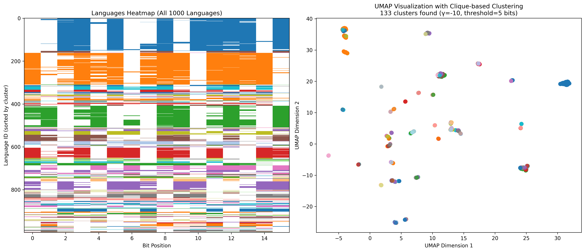
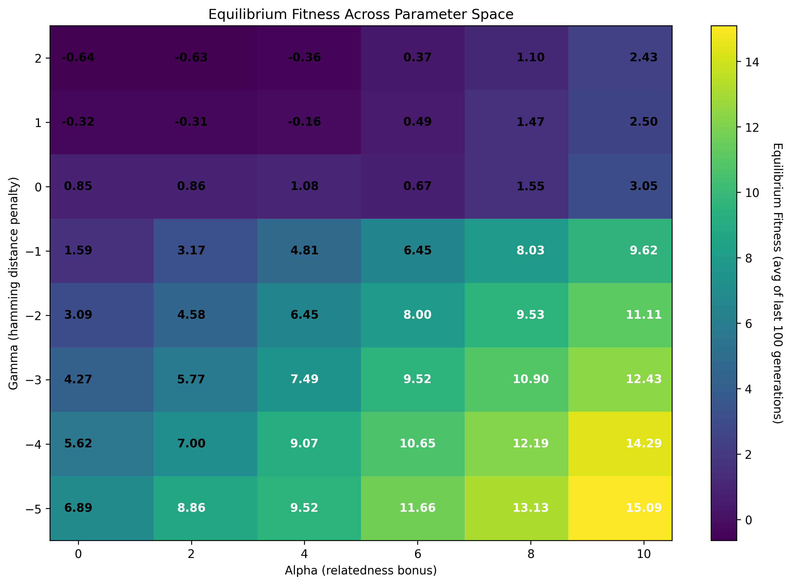
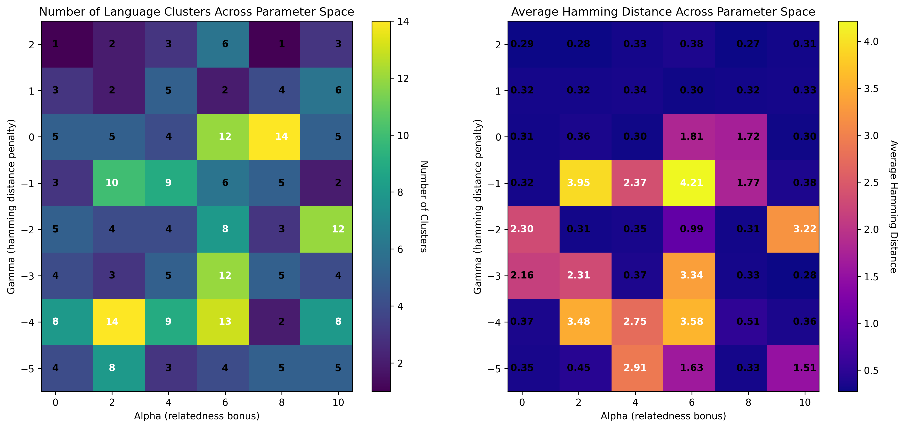

# Self-Organized Babel

$\\$

Riz Fernando Noronha

---

## Origin of Language

$\\$

> *Language has evolved as a   **means of communication***

$\\$

Is that  really true?

---

---

## Diversity & Complexity

$\\$

- English speakers can't learn Japanese!

- While we can communicate through body language, it's not as easy to do so through spoken language!

---

## The Model

$\\$

Language can represented as a **bit string** of length $L$
Each bit represents a *complexity* in the language

$\\$

$$\vec{c} = \underbrace{\left[0,1,0,0,0,1,0 \right]}_L$$

---

### Evolutionary Algorithm

$\\$

- Start with agents, each speaks their own language
- Agents compete and gain fitness
- Fittest agents reproduce

---

### Fitness Function

$\\$

Agents $A$ and $B$ compete against each other.

$\\$

$$ \mathcal{F_A} = \underbrace{\lVert \vec{c}_A \rVert_1}_\textrm{complexity} + \underbrace{\gamma \,d_\mathcal{H}(\vec{c}_A,\vec{c}_B)}_\textrm{discommunication} + \underbrace{\alpha \,d_\mathcal{G}(A, B)}_\textrm{family} $$

---

### Exact evolutionary details:

- Each generation, the $N$ agents play $N_{rounds}$ games.

- Each round, agents are ranomly paired up and play.

- Average fitness is calculated.

- Agents reproduce with weight $e^{\beta \mathcal{F}}$.

- New agents' languages are inherited, but each bit can flip with probability $\mu$.

---

### Generational Distance $d_\mathcal{G}$

$\\$

Each agent keeps a vector of ancestors. For example,

$$
\begin{align*}
19 &: \left[ 23, 17, 50 \right] \\
14 &: \left[ 9, 17, 50 \right]  
\end{align*}
$$

$d_\mathcal{G}=2$

---

### Evolutionary Parameters

$\\$

$N$ : Number of agents
$N_{rounds}$ : Number of games per generation
$N_{generations}$ : Number of generations
$\mu$ : Mutation rate
$\beta$ : Selection pressure

---

### "Real" Parameters

$\\$

$\alpha$ : Relatedness bonus
$\gamma$ : Discommunication bonus

$L$ : Length of the bit string
${d_\mathcal{G}}_\textrm{max}$ : Maximum generational distance

---

### Analyzing resultant languages

$\\$

Need a nice **clustering algorithm!**

DBSCAN has a problem, if A links with B, and B links with C, then A and C are linked!

Clique based clustering?

---

## Results

$\\$

....Not a lot....

---

#### Clustering after UMAP

---

#### Clustering in Hamming Space

---

#### Clique Clustering in Hamming Space

---

---

